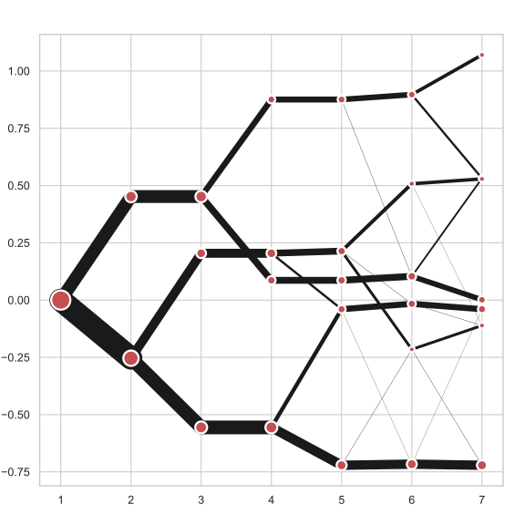

# Clustergram



## Visualization and diagnostics for cluster analysis

Clustergram is a diagram proposed by Matthias Schonlau in his paper *[The clustergram: A graph for visualizing hierarchical and nonhierarchical cluster analyses](https://journals.sagepub.com/doi/10.1177/1536867X0200200405)*.

> In hierarchical cluster analysis, dendrograms are used to visualize how clusters are formed. I propose an alternative graph called a “clustergram” to examine how cluster members are assigned to clusters as the number of clusters increases. This graph is useful in exploratory analysis for nonhierarchical clustering algorithms such as k-means and for hierarchical cluster algorithms when the number of observations is large enough to make dendrograms impractical.

The clustergram was later implemented in R by [Tal Galili](https://www.r-statistics.com/2010/06/clustergram-visualization-and-diagnostics-for-cluster-analysis-r-code/), who also gives a thorough explanation of the concept.

This is a Python translation of Tal's script written for `scikit-learn` and RAPIDS `cuML` implementations of K-Means clustering (as of v0.1).

## Getting started

```shell
pip install git+git://github.com/martinfleis/clustergram.git
```

The example of clustergram on Palmer penguins dataset:

```python
import seaborn
df = seaborn.load_dataset('penguins')
```

First we have to select numerical data and scale them.

```python
from sklearn.preprocessing import scale
data = scale(df.drop(columns=['species', 'island', 'sex']).dropna())
```

And then we can simply pass the data to `clustergram`.
```python
from clustergram import Clustergram

cgram = Clustergram(range(1, 8))
cgram.fit(data)
cgram.plot()
```


## Styling

`clustergram` returns matplotlib axis and can be fully customised as any other matplotlib plot.

```python
seaborn.set(style='whitegrid')

cgram.plot(
    ax=ax,
    size=0.5,
    linewidth=0.5,
    cluster_style={"color": "lightblue", "edgecolor": "black"},
    line_style={"color": "red", "linestyle": "-."},
    figsize=(12, 8)
)
```


## Mean options

On the `y` axis, a clustergram can use mean values as in the original paper by Matthias Schonlau or PCA weighted mean values as in the implementation by Tal Galili.

```python
cgram = Clustergram(range(1, 8), pca_weighted=True)
cgram.fit(data)
cgram.plot(figsize=(12, 8))
```


```python
cgram = Clustergram(range(1, 8), pca_weighted=False)
cgram.fit(data)
cgram.plot(figsize=(12, 8))
```


## Scikit-learn and RAPIDS cuML backends

Clustergram offers two backends for the computation - `scikit-learn` which uses CPU and RAPIDS.AI `cuML`, which uses GPU. Note that both are optional dependencies, but you will need at least one of them to generate clustergram.

Using scikit-learn (default):

```python
cgram = Clustergram(range(1, 8), backend='sklearn')
cgram.fit(data)
cgram.plot()
```

Using cuML (default):

```python
cgram = Clustergram(range(1, 8), backend='cuML')
cgram.fit(data)
cgram.plot()
```

`data` can be all data types supported by the selected backend (including `cudf.DataFrame` with `cuML` backend).

## References
Schonlau M. The clustergram: a graph for visualizing hierarchical and non-hierarchical cluster analyses. The Stata Journal, 2002; 2 (4):391-402.

Schonlau M. Visualizing Hierarchical and Non-Hierarchical Cluster Analyses with Clustergrams. Computational Statistics: 2004; 19(1):95-111.

https://www.r-statistics.com/2010/06/clustergram-visualization-and-diagnostics-for-cluster-analysis-r-code/