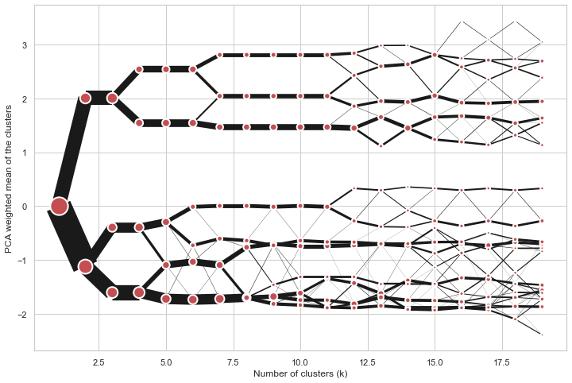
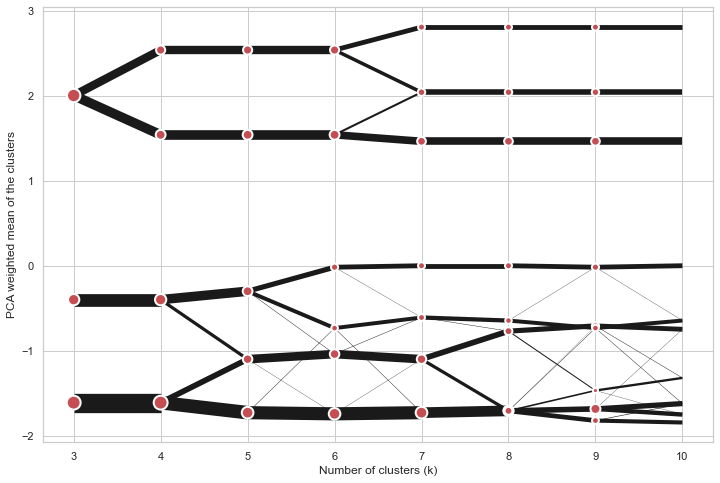

Clustergram
===========

Visualization and diagnostics for cluster analysis
--------------------------------------------------

Clustergram is a diagram proposed by Matthias Schonlau in his paper `The
clustergram: A graph for visualizing hierarchical and nonhierarchical
cluster analyses`_:

`In hierarchical cluster analysis, dendrograms are used to visualize
how clusters are formed. I propose an alternative graph called a
“clustergram” to examine how cluster members are assigned to clusters
as the number of clusters increases. This graph is useful in
exploratory analysis for nonhierarchical clustering algorithms such
as k-means and for hierarchical cluster algorithms when the number of
observations is large enough to make dendrograms impractical.`

The clustergram was later implemented in R by `Tal Galili`_, who also
gives a thorough explanation of the concept.

This is a Python translation of Tal's script written for
``scikit-learn`` and RAPIDS ``cuML`` implementations of K-Means
clustering.

Getting started
---------------

.. code:: shell

   pip install clustergram

The example of clustergram on Palmer penguins dataset:

.. code:: python

   import seaborn
   df = seaborn.load_dataset('penguins')

First we have to select numerical data and scale them.

.. code:: python

   from sklearn.preprocessing import scale
   data = scale(df.drop(columns=['species', 'island', 'sex']).dropna())

And then we can simply pass the data to ``clustergram``.

.. code:: python

   from clustergram import Clustergram
   cgram = Clustergram(range(1, 8))
   cgram.fit(data)
   cgram.plot()

|Default clustergram|

Styling
-------

``Clustergram.plot()`` returns matplotlib axis and can be fully customised as
any other matplotlib plot.

.. code:: python

   seaborn.set(style='whitegrid')

   cgram.plot(
       ax=ax,
       size=0.5,
       linewidth=0.5,
       cluster_style={"color": "lightblue", "edgecolor": "black"},
       line_style={"color": "red", "linestyle": "-."},
       figsize=(12, 8)
   )

|Colored clustergram|

Mean options
------------

On the ``y`` axis, a clustergram can use mean values as in the original
paper by Matthias Schonlau or PCA weighted mean values as in the
implementation by Tal Galili.

.. code:: python

   cgram = Clustergram(range(1, 8), pca_weighted=True)
   cgram.fit(data)
   cgram.plot(figsize=(12, 8))

|image1|

.. code:: python

   cgram = Clustergram(range(1, 8), pca_weighted=False)
   cgram.fit(data)
   cgram.plot(figsize=(12, 8))

|image2|

Scikit-learn and RAPIDS cuML backends
-------------------------------------

Clustergram offers two backends for the computation - ``scikit-learn``
which uses CPU and RAPIDS.AI ``cuML``, which uses GPU. Note that both
are optional dependencies, but you will need at least one of them to
generate clustergram.

Using scikit-learn (default):

.. code:: python

   cgram = Clustergram(range(1, 8), backend='sklearn')
   cgram.fit(data)
   cgram.plot()

Using cuML (default):

.. code:: python

   cgram = Clustergram(range(1, 8), backend='cuML')
   cgram.fit(data)
   cgram.plot()

``data`` can be all data types supported by the selected backend
(including ``cudf.DataFrame`` with ``cuML`` backend).

Partial plot
------------

``Clustergram.plot()`` can also plot only a part of the diagram, if you want to focus on a limited range of ``k``.

.. code:: python

   cgram = Clustergram(range(1, 20))
   cgram.fit(data)
   cgram.plot(figsize=(12, 8))

|Long clustergram|

.. code:: python

   cgram.plot(k_range=range(3, 10), figsize=(12, 8))

|Limited clustergram|

Saving clustergram
------------------

You can save both plot and ``clustergram.Clustergram`` to a disk.

Saving plot
~~~~~~~~~~~

``Clustergram.plot()`` returns matplotlib axis object and as such can be
saved as any other plot:

.. code:: python

   import matplotlib.pyplot as plt

   cgram.plot()
   plt.savefig('clustergram.svg')

Saving object
~~~~~~~~~~~~~

If you want to save your computed ``clustergram.Clustergram`` object to
a disk, you can use ``pickle`` library:

.. code:: python

   import pickle

   with open('clustergram.pickle','wb') as f:
       pickle.dump(cgram, f)

Then loading is equally simple:

.. code:: python

   with open('clustergram.pickle','rb') as f:
       loaded = pickle.load(f)

References
----------

Schonlau M. The clustergram: a graph for visualizing hierarchical and
non-hierarchical cluster analyses. The Stata Journal, 2002; 2
(4):391-402.

Schonlau M. Visualizing Hierarchical and Non-Hierarchical Cluster
Analyses with Clustergrams. Computational Statistics: 2004;
19(1):95-111.

https://www.r-statistics.com/2010/06/clustergram-visualization-and-diagnostics-for-cluster-analysis-r-code/

.. toctree::
   :maxdepth: 2
   :caption: Documentation:

   api
   GitHub <https://github.com/martinfleis/clustergram>

Indices and tables
==================

* :ref:`genindex`
* :ref:`modindex`
* :ref:`search`

.. _`The clustergram: A graph for visualizing hierarchical and nonhierarchical cluster analyses`: https://journals.sagepub.com/doi/10.1177/1536867X0200200405
.. _Tal Galili: https://www.r-statistics.com/2010/06/clustergram-visualization-and-diagnostics-for-cluster-analysis-r-code/

.. |Default clustergram| image:: _static/default.png
.. |Colored clustergram| image:: _static/colors.png
.. |image1| image:: _static/pca_true.png
.. |image2| image:: _static/pca_false.png

